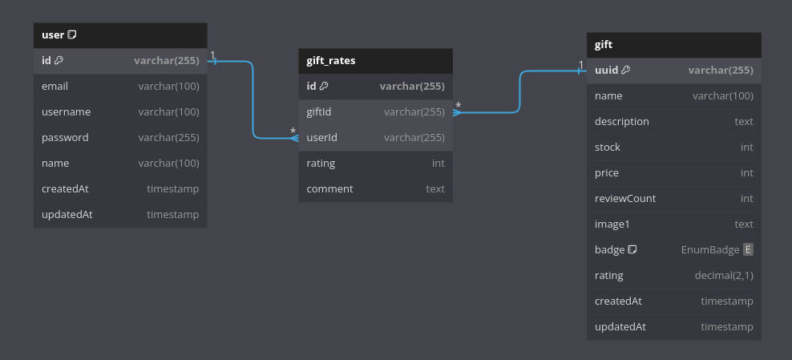

<p align="center">
  <a href="http://nestjs.com/" target="blank"></a>
</p>

[circleci-image]: https://img.shields.io/circleci/build/github/nestjs/nest/master?token=abc123def456
[circleci-url]: https://circleci.com/gh/nestjs/nest

  <p align="center">A progressive <a href="http://nodejs.org" target="_blank">Node.js</a> framework for building efficient and scalable server-side applications.</p>

## Description

Gift service API, 

### Features:
- create user
- login
- CRUD gift
- rate gift: will increate `gift.review_count` and calculate `gift.rating`
- redeem gift


## Preparation  
make sure you have postgresql database named `postgre`.  

if you have database desktop client 
just import `docs/db_schema.sql` file.  

or use psql:
```bash
$ psql -U <dbuser> -h <host> <dbname> < ./docs/db_schema.sql
```

if you use vscode, you can easily run with devcontainer just by installing devcontainer extension.

copy `.env.example` to `.env` and adjust the value as you need.

```bash
# db migrate
$ npm run migrate

# db seed
$ npx prisma db seed
# check ./prisma/seed/seed.ts
```

## Running the app

```bash
# development
$ npm install
# if you have problem with bcyprt:
$ npm install node-gyp 

$ npm run start

# create user first for mutating data
# all gift api guarded by jwt bearer token, except read api
$ curl --location 'http://localhost:3000/users' \
--header 'Content-Type: application/json' \
--data-raw '{
    "username": "maria",
    "password": "guess",
    "email" : "maria@guess.com",
    "name": "maria"
}'
# next, see postman doc


# watch mode
$ npm run start:dev

# production mode
$ npm run start:prod
```


## Postman
[postman-collection.json](./docs/RollingGlorry.postman_collection.json)  

## Swagger
when you run the app, it will server swagger page on `http://localhost:3000/api`

## ERD
[erd.dbml](./docs/erd.dbml)

